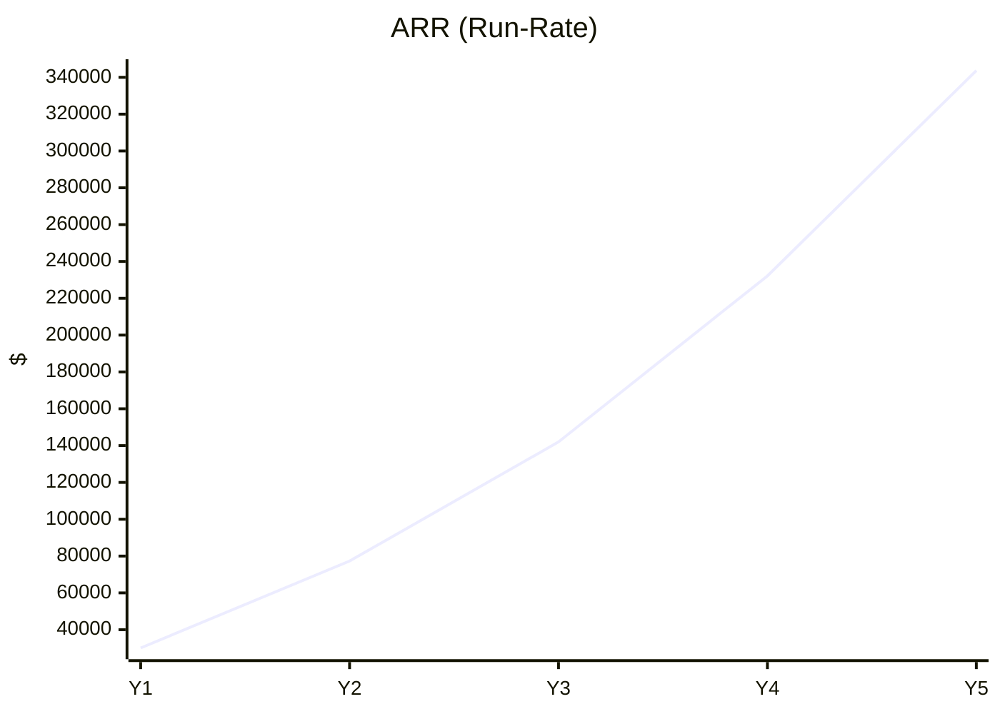
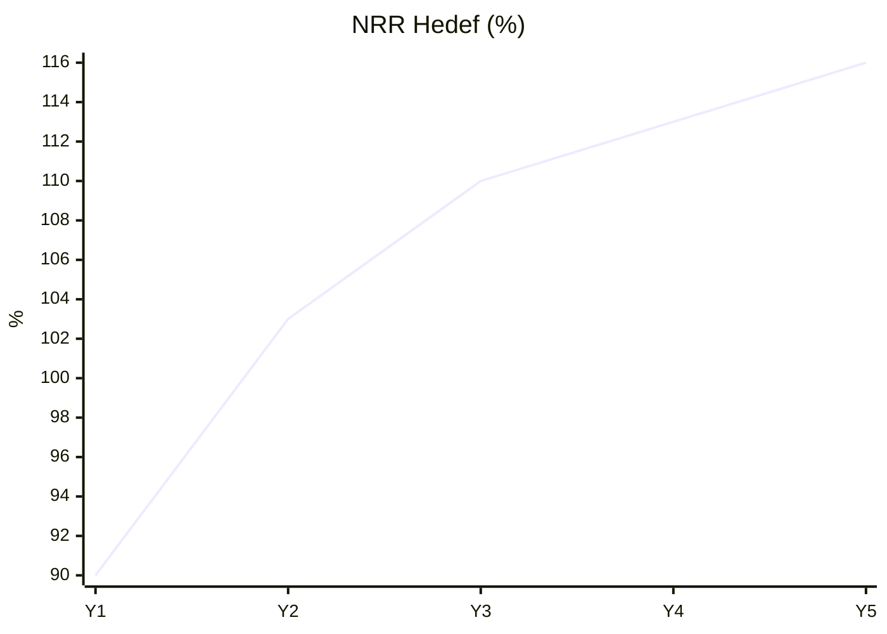

# FinAsis – Yatırımcı Sunumu (TR)

Bu sunum, FinAsis'in pazar problemi, çözümü, ürün-yol haritası ve finansal ölçeklenme tezini özetler. Referans: `financial_assumptions.md`, `5_year_revenue_model.md`, `funding_milestones.md`, `unit_economics_kpis.md`, `scenario_sensitivity.md`.

## 1) Özet (Elevator Pitch)
- FinAsis: KOBİ ve ileri bireysel/küçük ekip yatırımcılar için finansal verileri tekleştiren; nakit akışı öngörüsü, gider analizi, anomali tespiti ve kural bazlı otomasyon sunan çoklu-tenant SaaS.
- Değer: Finansal görünürlük + öngörü + otomasyon; NRR>100% hedefiyle sermaye verimli büyüme.
- Bugün (durum): erken aşama; pilot/pipeline toplam ≈15 hesap (ödeme akışları sandbox; üretim geçişi planlanıyor). Y5 baz ARR hedefi ≈ $344K; brüt marj %83; payback <9 ay (Y3) — bunlar model varsayımlarıdır.

## 2) Problem ve Fırsat
Çekirdek problem kümeleri:
- Dağınık veri ve manuel birleştirme: banka, e‑fatura/UBL‑TR, POS, e‑ticaret, aracı kurum, kripto + Excel.
- Geç görünürlük ve zayıf öngörü: Nakit akışı, vergi/ödeme yükümlülükleri sürpriz; forecast ve senaryo eksik.
- Hata/anomali ve denetim yükü: Çift fatura, KDV/tevkifat dağılım hataları, dönem sonu işlemleri; export ve audit hazırlığı manuel.
- Aksiyon üretmeyen raporlar: BI ekranı var, ancak “kural/otomasyon” yok → operasyon ölçeklenmiyor.
- Yerel uyumluluk & entegrasyon: EDOC/UBL‑TR, GİB akışları ve bölgesel gereksinimler.

FinAsis çözümü — önce/sonra:
- Önce: Excel + manuel mutabakat → Sonra: Tek panel, otomatik entegrasyon ve kural motoru ile “oto‑kayıt” (auto‑book önizleme).
- Önce: Geriye dönük rapor → Sonra: Risk skoru, tahmin (Prophet) ve öneri API’leriyle proaktif uyarı/öneri.
- Önce: Denetim/audit için stresli hazırlık → Sonra: Audit‑ready loglar, rapor/export ve blockchain tabanlı doğrulanabilir kayıt opsiyonu.
- Hedef etki: Aktivasyon ≥ %55 (Y1), NRR ≥ %100 (Y2), Payback < 9 ay (Y3) — sermaye verimli büyüme.

## 3) Çözüm (Ürün)
- Modüller: Accounting, Finance (raporlar), AI Assistant (risk skoru, tahmin, öneri), Rule Engine, Education (FinEd), Games (FinGame), Blockchain entegrasyonu (şeffaf kayıtlar).
- Özellikler: Çoklu dil, modern arayüz, audit-ready loglama, e-belge/EDOC entegrasyonları.
- Demo akışı: Kayıt → Plan seçimi/ödeme (PayTR sandbox) → Abonelik aktivasyonu → Finansal raporlar → AI/Otomasyon (auto-book).

Durum (gerçekçilik notu – canlı vs. yol haritası):
- Raporlar ve temel muhasebe ekranları: [Mevcut]
- PayTR ödeme akışı: [Sandbox] (üretim geçişi planlanıyor)
- Auto‑book önizleme (kural/AI destekli): [Önizleme/PoC]
- Rule Engine v1: [Yol haritası 3–6 Ay]
- Add‑on API: [Beta 6–9 Ay] → [GA 12–18 Ay]
- Anomaly precision > %85, şablon galerisi: [Yol haritası 9–12 Ay]
- Blockchain tabanlı doğrulanabilir kayıt: [Opsiyonel/PoC]
- EDOC/UBL‑TR doğrulama ve akışlar: [Opsiyonel/konfigürasyonla etkin]

## 4) Hedef Müşteri ve Pazar (nitel)
- ICP: 1–100 çalışan KOBİ’ler, ajanslar, e-ticaret girişimleri, ileri bireysel yatırımcılar/küçük ekipler.
- Alım tetikleyicileri: Büyüyen işlem hacmi, çok hesap/çok kanal, denetim ihtiyacı, rapor karmaşıklığı.
- Pazar büyüklüğü (nitel): Bölgesel KOBİ sayısı ve dijitalleşme trendi ile > yüzbinler düzeyinde hedeflenebilir müşteri.

## 5) İş Modeli ve Fiyatlandırma
- Abonelik SaaS (aylık/yıllık). Paketler: Core ($29), Growth ($59), Scale ($129). Add-on: API/Webhook (+$39), Gelişmiş Rapor (+$19).
- Kullanıcı (seat) upsell ve add-on attach ile ARPA artışı; yıllık ödeme indirimi (%15) kısmi.

## 6) Traction (Bugün) & Hedef Metrikler (Model)
Bugün (kanıt noktaları):
- Pilot/pipeline toplam ≈15 hesap; yerel ortamda rapor ekranları ve EDOC seçenekleri; PayTR sandbox akışı çalışır.
- Demo runbook: `docs/demo_senaryosu.md` (kayıt → plan → ödeme → rapor → AI/auto‑book önizleme).

Hedefler (model varsayımları):
- Müşteri sayısı: 6–12–18–24. ay hedefleri: 45 → 95 → 190 → 300 aktif müşteri.
- Yıl sonu run‑rate ARR (baz): Y1 $30K → Y3 $142K → Y5 $344K.
- ARPA: $44 → $68 → $86 (Y1→Y3→Y5). NRR hedef eğrisi: %90 → %110+ (Y1→Y3).
- Brüt marj: %70 → %78 → %83 (Y1→Y3→Y5). Payback: Y3 ≈ 7.9 ay. LTV/CAC: Y3 ≈ 3.6x (hedef Y5 ≥ 7.5x).

## 7) Rekabet ve Ayrışma
Rakip haritası (özet):

| Kategori | Güçlü yön | Zayıf yön | FinAsis ayrışma |
|---|---|---|---|
| ERP muhasebe modülleri | Finansal kayıt, yerleşik süreçler | Kurulum/ağır süreç, entegrasyon kısıtları, düşük öngörü | Hafif kurulum, zengin entegrasyon, AI + kural motoru ile aksiyon |
| Tek‑özellikli araçlar (fatura/gider/POS) | Hızlı başlama, basit kullanım | Veri silo, sınırlı rapor/otomasyon | Çok kaynaktan tek panel + rule engine + öneri |
| Genel BI/dashboard | Esnek görselleştirme | Veri hazırlığı zor, aksiyon üretmez | Muhasebe motoru + AI ile “öneri/otomasyon” odaklı katman |

Neden FinAsis?
- Entegrasyon derinliği ve yerel uyumluluk: EDOC/UBL‑TR şema doğrulama, GİB akış şablonları, çoklu kaynak bağlayıcıları.
- Rule Engine & Muhasebe Motoru: JSON kural tabanlı `PostingRule` → `Voucher` üretimi, auto‑book önizleme ile operasyona doğrudan etki.
- AI Asistan: Risk skoru, finansal tahmin (Prophet) ve öneri API’leri; JWT/Session korumalı, Swagger/Redoc ile dokümante.
- Audit‑ready ve güvenlik: HMAC/IP doğrulamalı callback, kapsamlı audit log; blockchain tabanlı doğrulanabilir kayıt opsiyonu.
- Hızlı aktivasyon ve adaptasyon: Self‑serve onboarding; FinEd & gamification; çoklu dil (i18n) ile geniş erişim.
- Sermaye verimi ve TCO: Hızlı değer teslimi (aktivasyon hedefleri), NRR > %100’e giden yol, düşük kurulum/işletim maliyeti.

### 7.1) Rekabet Matrisi (örnek)

Not: Bu tablo genel pazar gözlemlerine dayanır; ürün sürümleri ve müşteri segmentlerine göre farklılık gösterebilir.

| Ürün | Entegrasyon kapsamı | EDOC/UBL‑TR | Rule Engine / Otomasyon | AI (Risk/Tahmin/Öneri) | Audit / Blockchain | TCO / Deployment |
|---|---|---|---|---|---|---|
| FinAsis | Banka, e‑fatura, POS, e‑ticaret, aracı kurum, kripto | Opsiyonel/konfig. ile | JSON PostingRule → Voucher (auto‑book önizleme) | Var (API; risk, tahmin, öneri) | Audit log + ops. blockchain | Hafif (SaaS), hızlı aktivasyon |
| Logo / Netsis (ERP) | Modül/partner ile | Var | Genel iş akışları; özel rule sınırlı | Sınırlı | Geleneksel | Orta‑Ağır (on‑prem/partner) |
| Mikro (ERP) | Modül/partner ile | Var | Genel iş akışları; özel rule sınırlı | Sınırlı | Geleneksel | Orta‑Ağır (on‑prem/partner) |
| Paraşüt (SaaS) | Temel finans/efatura odaklı | Var | Sınırlı otomasyon | Sınırlı | Yok | Hafif; kapsam dar |
| Luca (SaaS) | Muhasebe odaklı | Var | Sınırlı otomasyon | Sınırlı | Yok | Hafif; meslek odaklı |
| Power BI / Metabase (BI) | ETL ile; veri müh. gerekir | Yok | Yok | Genel/özelleştirme ile | Yok | Araç lisansı + modelleme |

Özet: FinAsis “görünürlük + öngörü + otomasyon” üçlüsünü yerel uyumluluk ve hafif kurulumla birleştirir; yalnızca raporlama değil, operasyonel aksiyon üreten katmandır.

Trade‑off ve sınırlar (gerçekçi beklenti):
- ERP kapsamını bütünüyle ikame etmiyoruz; görünürlük/öngörü/otomasyon katmanıyız.
- Forecast/öneri kalitesi entegrasyon kapsamı ve veri kalitesine duyarlıdır.
- Güvenlik/SOC sertifikasyonu planlı bir yol haritası maddesidir; bugün “temel kontroller + dış inceleme” yaklaşımı vardır.
- Blockchain/audit izleri opsiyoneldir; performans ve maliyet dengesi müşteri bazında yapılandırılır.
- EDOC/e‑defter akışları bazı ortamlarda “stub/şablon” modunda çalışır; üretim konfigürasyonu müşteriye özel yapılır.

## 8) Go-To-Market (GTM)
- Kanallar: İçerik & SEO, partner/entegrasyon ekosistemi, kurucu-led satış, topluluk/webinar; sınırlı ve disiplinli paid.
- Funnel hedefleri: Visit→Lead %3.5; Lead→Trial %40; Trial→Aktivasyon %55 (Y1) → %63 (Y3); Aktivasyon→Ücretli %60+.
- Metric-gated hiring: satış ve CSM ölçeklemesi metrik eşiklerine bağlı.

## 9) Teknoloji ve Güvenlik
- Backend: Django. Çoklu dil/i18n, event logging, audit log. EDOC/UBL-TR şema doğrulama opsiyonu.
- ML API’leri: Risk skoru, finansal tahmin, öneri sistemi (JWT/Session korumalı).
- Güvenlik/uyum: HMAC/IP doğrulamalı callback, erişim kontrolleri; SOC hazırları (kilometre taşlarında dış inceleme).

## 10) Yol Haritası & Kilometre Taşları (24 Ay)
- 0–3 Ay: 5→8 entegrasyon, anomaly MVP, 20 aktif pilot; Aktivasyon ≥ %45.
- 3–6 Ay: Rule engine v1, forecast iyileştirme; 40–45 aktif müşteri; churn ≤ %5.2.
- 6–9 Ay: Add-on API beta, rapor export; 70 müşteri; ilk >$5K MRR; NRR (3M) ≥ %95.
- 9–12 Ay: Anomaly precision > %85, şablon galerisi; 90–100 müşteri; ARPA $50+.
- 12–18 Ay: API GA, advanced forecasting; 150→200 müşteri; NRR ≥ %102; LTV/CAC >3.2x.
- 18–24 Ay: Segment fiyat optimizasyonu; 230→300 müşteri; Payback <9 ay; NRR ≥ %108.

Not: Bu kilometre taşları ürün/entegrasyon hızı, kanal verimliliği ve müşteri geri bildirimine bağlı olarak üçer aylık periyotlarda “metric‑gated” şekilde yeniden planlanacaktır.

## 11) Finansal Model Özeti (Baz)
- Müşteri (yıl sonu): 57 → 115 → 174 → 248 → 333 (Y1→Y5).
- Run-rate ARR ($): 30K → 77K → 142K → 232K → 344K.
- Brüt kâr (ARR baz): 21K → 57K → 111K → 187K → 285K.
- CAGR (Y1→Y5): ≈ %90. Duyarlılık: ARPA ±$5 → Y5 ARR ~±%9; Churn ±0.5 puan → ~±%6–7.

### 11.1) Görseller (Basit Trendler)

ARR (run‑rate) trendi:

NRR hedef eğrisi:

Not (model gerçekçiliği): Bu değerler `financial_assumptions.md` içindeki varsayımlara dayanır ve 
pipeline kalitesi, entegrasyon kapsamı, fiyat/indirim disiplini ve churn dinamikleriyle anlamlı 
şekilde değişebilir. `scenario_sensitivity.md` içindeki bandlar referans alınmalıdır.

## 11.1) Varsayım ve Kısıtlar (Gerçekçilik Notları)
- Müşteri edinim oranları ve CAC, kanal karışımına (organik/paid/partner) duyarlıdır.
- ARPA artışı; paket miks kayması, add‑on attach ve seat upsell performansına bağlıdır.
- NRR > %100 için rule engine kullanımı ve add‑on uptake kritik kaldıraçtır.
- Brüt marj hedefleri; entegrasyon API çağrı maliyeti ve hosting verimliliği optimizasyonlarıyla 
kademe kademe iyileşecektir.

## 12) Birim Ekonomisi (Hedef Bantlar)
- CAC (blended): $450 → $380 (Y1→Y5). Payback (Y3): ~7.9 ay.
- LTV (Y3 baz): ~$1,520; LTV/CAC: ~3.6x (hedef Y5 ≥ 7.5x).
- NRR hedefi: Y2 ≈ %100+, Y3 ≈ %108–112, Y5 ≈ %115–118.

## 13) Ekip
- Çekirdek: Kurucu (Tech/Product). Kademeli işe alım: Backend, Full-stack, Data/ML, Growth, SDR, CSM, PM, QA, Compliance (fractional).
- İlke: Metric-gated hiring; her FTE için MRR/kullanım eşiği.

## 14) Yatırım Tutarı ve Kullanımı (Use of Funds)
- Talep: Pre-Seed $400K (alternatif: $600K Extended).
- Dağılım (400K örneği): Ürün&Müh. %38, Veri&ML %10, GTM %25, Güvenlik %8, G&A %9, Rezerv %10.
- Runway: ~8–10 ay efektif (erken gelir katkısıyla uzatma). Extended senaryoda 11–12 ay + ek ivme.

## 15) Riskler ve Mitigasyon
- Aktivasyon düşük → Setup wizard & içerik revizyon, CSM playbook.
- Churn yüksek → Health score, kural kullanımı artırma, segment bazlı paketler.
- CAC yükselmesi → Paid rotasyonu, organik güçlendirme, partner kanalı.
- Güvenlik olayı → Temel CIS kontrolleri, pen test takvimi, log & SIEM.

## 16) Kapanış ve Çağrı
- Misyon: KOBİ’ler için finansal görünürlük ve otomasyonu “kolay ve erişilebilir” kılmak.
- Hedef: 18–24 ayda seed-ready metrik paketine ulaşmak (ARR ≥ $300K, NRR ≥ %108, Payback ≤ 8 ay, LTV/CAC ≥ 4x).
- İletişim: demo & teknik inceleme için hazırız. Ekler: Demo senaryosu, metrik tanımları, finansal model.

---
Ekler: `demo_senaryosu.md`, `unit_economics_kpis.md`, `5_year_revenue_model.md`, `funding_milestones.md`.
