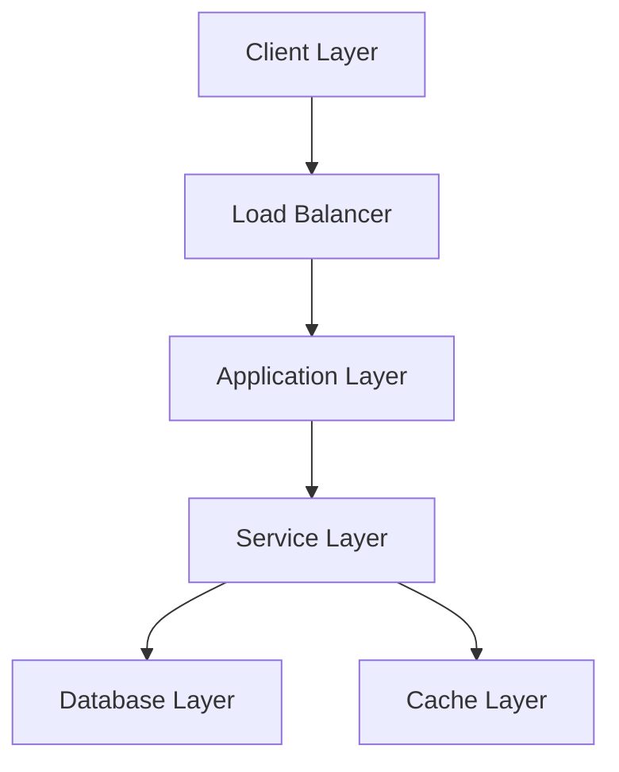
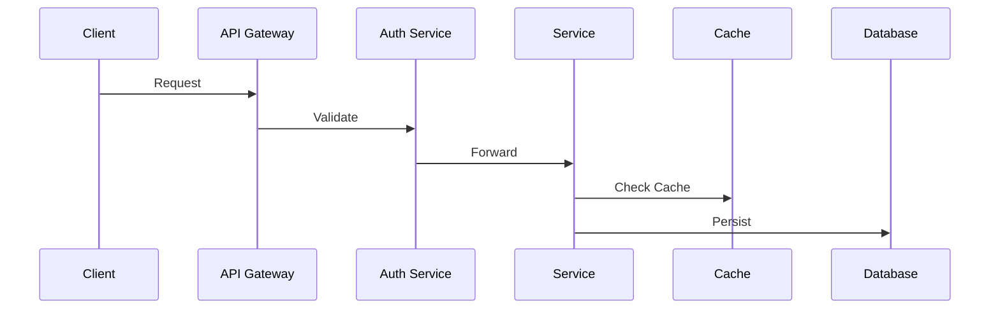

# System Architecture

## Infrastructure Overview

## Microservices
- Authentication Service
- Trading Engine
- Analytics Service
- Notification Service
- AI Assistant Service

## Database Architecture
### Primary Databases
- PostgreSQL: User data, transactions
- MongoDB: Analytics, logs
- Redis: Caching, real-time data

### Data Flow

## Scaling Strategy
- Horizontal scaling with Kubernetes
- Auto-scaling based on load
- Multi-region deployment
